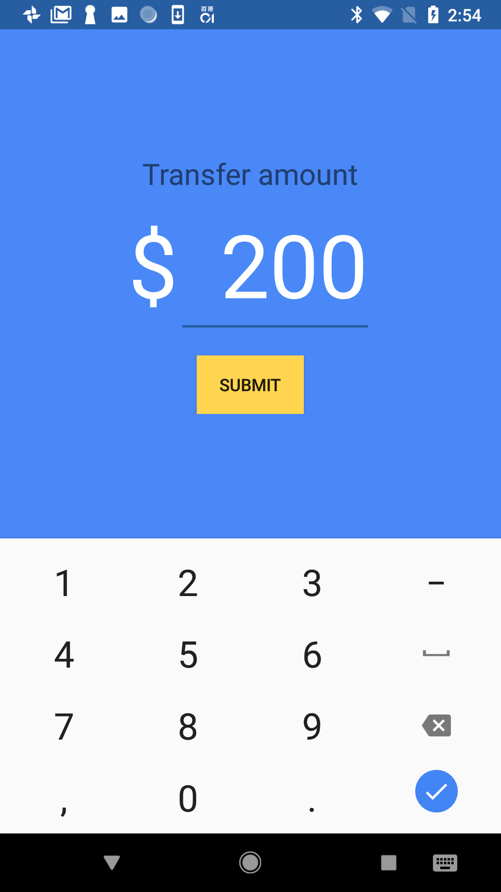
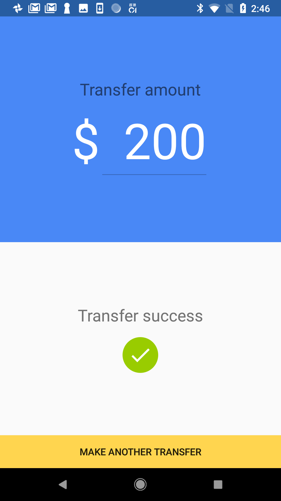

# Transfer

> This project is to demonstrate the usage of MVP with latest Android Architecture Components including ViewModel, LiveData and Data Binding.

ViewModel adapt the lifecycles of activity, to make sure UI status persist when activity re-created, e.g. device screen is rotated.

Using LiveData together with Data Binding facility the separation of View and Presenter. i.e. `activity_main.xml` connects events to `MainView`, `MainActivity` implements `MainView` and pass the handling to `MainPresenter`. Presenter manipulate LiveData in ViewModel, the view then updated correspondingly.

A simple static JSON file host on http://myjson.com/ is used as the dummy API response. Currently this project is using GET method to call API. In real environment, this would be a POST method.

Unit tests and Instrument tests are included.

### Screen captures

#### Transfer amount input

#### Result success

### Third party library used

#### Retrofit 2
Use as HTTP client for calling API, and convert response JSON to data object

#### RxJava 2
Reactive Extensions for Java
